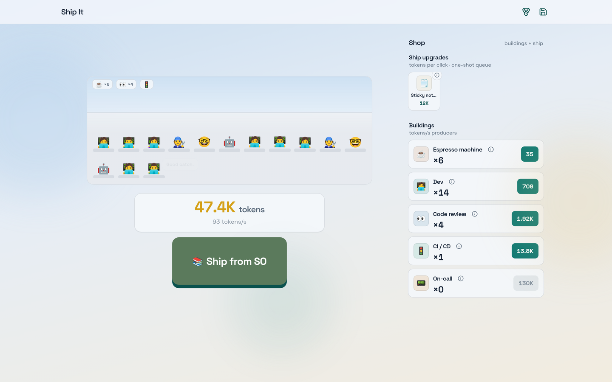

# Ship It

Developer-themed incremental game — ship software, earn tokens, grow the office.



## Quick start

```bash
pnpm install
pnpm dev
```

Open the Vite URL (usually `http://localhost:5173`). HTML title is **Ship It**.

## Scripts

| Script                              | Purpose                                |
| ----------------------------------- | -------------------------------------- |
| `pnpm dev`                          | Vite dev server                        |
| `pnpm build`                        | Typecheck + production build → `dist/` |
| `pnpm preview`                      | Preview production build               |
| `pnpm lint`                         | ESLint                                 |
| `pnpm format` / `pnpm format:check` | Prettier                               |
| `pnpm typecheck`                    | TypeScript project references          |
| `pnpm test`                         | Vitest (unit)                          |

Node **≥24** suggested (`engines`). CI uses Node 24 + pnpm frozen lockfile.

## Docs

- [`docs/PRODUCT.md`](./docs/PRODUCT.md) — product / fantasy / economy decisions
- [`docs/TECHNICAL.md`](./docs/TECHNICAL.md) — stack / architecture / deploy
- [`docs/ISSUES.md`](./docs/ISSUES.md) — sequenced GitHub roadmap
- [`docs/modules/`](./docs/modules/) — living module docs
- [`AGENTS.md`](./AGENTS.md) — agent entrypoint
- [`REVIEW.md`](./REVIEW.md) — coding / review standards

## Deploy

Staging on Quave Cloud (`joaovictornsv-ship-it-staging`) lands in roadmap issue #12. Dockerfile + `httpd.conf` stubs are ready; workflow is stubbed.

## License

[MIT](./LICENSE)
